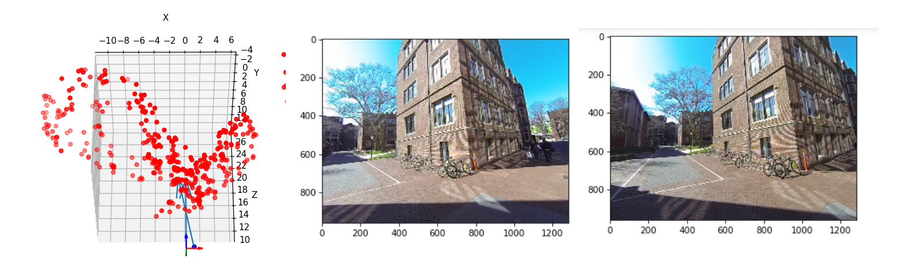
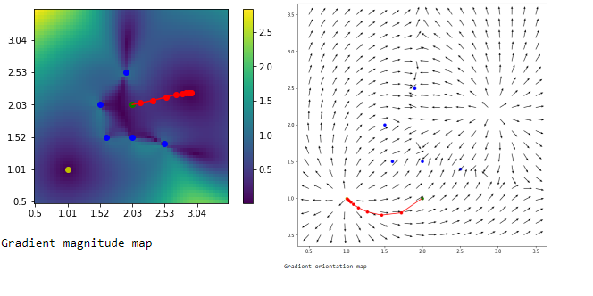
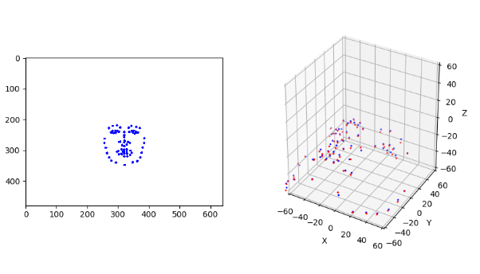
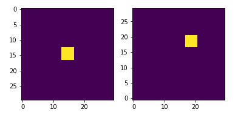
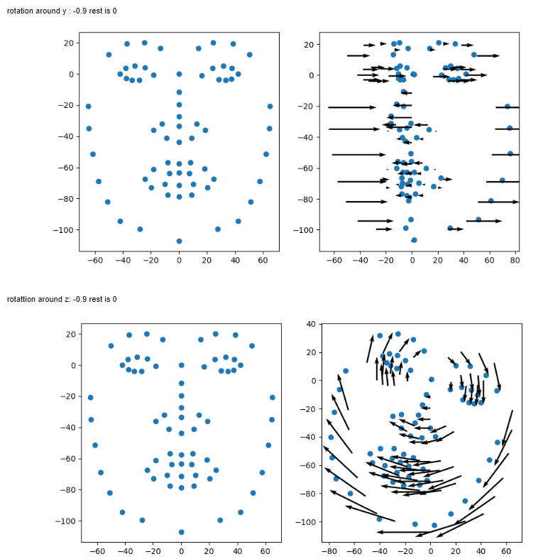
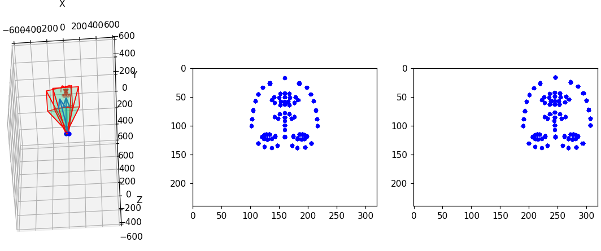

# Camera-Perception-Experiments

## 3D reconstruction

Notebook 3d_reconstruction.ipynb implements simple 3D reconstruction by computing Fundamental Matrix from feature points and Perspective n Points method. Other graphics in the notebook contain debug information such as the epipoles, reprojection error, etc. The implementation is based on the course Robotics:Perception from Coursera and from the book Multi View Geometry.

## 2D Beacon localisation

Notebook 2d_beacon_localisation.ipynb implements a simple Gauss-Newton optimization method for determining the 2D location of a point given the distances to every beacon and their known locations.

## Unscented Kalman Filter for orientation and position tracking

Notebook UKF.ipynb and folder UKF_pycharm contain the implementation of UKF for orientation and position as observable variables and angular velocity and velocity of translation as hidden variables. Having a system that outputs the 3d orientation as quaternions and 3d position with a level a noise, we want ot filter those outputs. As rotation is non linear, we need an UKF or EKF for this problem. 
In the following figure imagine a spaceship describing a random trajectory and orientation, and in the second figure is the spaceship measurement but added noise to it. The third figure is the output of the filter which is obviously not optimal.
 

## Pose estimation

The following notebooks implement the head pose estimation (rotation and translation). Given the 2D landmarks of the face and a known 3D model (possibly deformed using PCA), and the camera calibration matrix, find the rotation and translation parameters of the 3D model that produced the 2D projection.

Notebook tensorflow_pose_estimation.ipynb implements the algorithm by defining the computational graph of the projection function. Input to the graph are roll, yaw, pitch angles and translation as variables to be optimized. The next layers in the graph compute a rotation matrix, rotate, add translation, apply K, normalize the homogeneous coordinates and compute the loss function as the L2 distance between the projected points and the target 2D landmarks.

Notebook gauss_newton_head_pose_estimation.ipynb implements the algorithm by using the Gauss-Newton method

Notebook head_pose_estimation_3_params.ipynb implements the headpose estimation by computing the scale, 3d rotation and 2d translation of a 3D model. It is part of an iterative convergence algortihm to detect the 2D land marks of the face. Inspired from:

https://ibug.doc.ic.ac.uk/media/uploads/documents/3d_local_features.pdf
https://sites.google.com/site/xgyanhome/home/projects/clm-implementation
https://personalpages.manchester.ac.uk/staff/timothy.f.cootes/Models/clm.html
https://personalpages.manchester.ac.uk/staff/timothy.f.cootes/papers/BMVC06/cristinacce_bmvc06.pdf
 

## Optical flow

The following notebooks implement the optical flow algorithm based on the Gauss-Newton optimization method. It finds the 2D vector that shifts every pixel in the first figure towards the second figure

Notebook optical_flow_coursera.ipynb implements the method of optical flow described in Coursera Robotics:Perception course.
Notebook optical_flow_my_method.ipynb implements the optical flow algorithm in the way that I envisioned it which is actually a little bit faster that the one described above.

## Failures

The directory failures/ contains some notebooks which implement various algorithms that I failed to understand and implement. Among them are:
3D velocities from optical flow.

